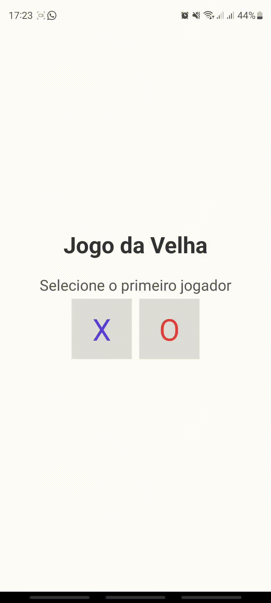

# React Native Tic-Tac-Toe Game

Welcome to the **React Native Tic-Tac-Toe Game** project! This mobile app allows you to play the classic game of Tic-Tac-Toe (also known as Noughts and Crosses) with a friend. It's a simple and fun way to pass the time and test your strategy skills.

## Features

- Play Tic-Tac-Toe on your mobile device.
- Select 'X' or 'O' to start the game.
- Enjoy a responsive and user-friendly interface.
- See the winner or a draw message at the end of the game.
- Restart the game from the menu screen.

## Getting Started

To get started with this project, follow these steps:

1. Clone or download the project files to your computer.
2. Make sure you have [Node.js](https://nodejs.org/) installed.
3. Open a terminal or command prompt in the project directory.
4. Run `npm install` to install the project dependencies.
5. Run `npm start` to start the Expo development server.
6. Use the Expo Go app on your mobile device to scan the QR code displayed in the terminal.

## Technologies Used

This project was built with the following technologies:

- React Native: A JavaScript framework for building mobile apps.
- Expo: A platform for building React Native apps quickly.
- JavaScript: The programming language used for app logic.
- CSS: Styles were applied using React Native's StyleSheet.

## Gameplay Instructions

- To start the game, select 'X' or 'O' on the main menu.
- Players take turns tapping empty cells to place their symbol ('X' or 'O').
- The game ends when a player wins by getting three symbols in a row horizontally, vertically, or diagonally or when all cells are filled (a draw).
- To restart the game, tap "Voltar ao menu" on the result screen.

## Demo

